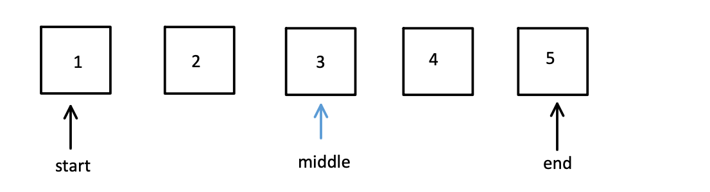

## 写在前面
这是自己学习算法题的练习小册子
[练习网站](https://codetop.cc/home)


## 试题
### [1.反转链表](https://leetcode.cn/problems/reverse-linked-list/)
频率：17

问题：  
给你单链表的头节点 head ，请你反转链表，并返回反转后的链表。


题解：  
定义三个指针，current、prev、tempNext  
迭代执行下面的操作 直到current不存在   
1、current的next指针指向prev  
2、三个指针（prev、current、tempNext）依次向右移动

TIPS：  
注意边界，current到最后的时候，tempNext是NULL，注意判空报错


```js
/**
 * Definition for singly-linked list.
 * function ListNode(val, next) {
 *     this.val = (val===undefined ? 0 : val)
 *     this.next = (next===undefined ? null : next)
 * }
 */
/**
 * @param {ListNode} head
 * @return {ListNode}
 */
var reverseList = function(head) {
    if (!head || !head.next) {
        return head
    }
    let prev = null;
    let current = head;
    let tempNext = head.next;
    while(current) {
        current.next = prev;
        prev = current
        current = tempNext
        tempNext = tempNext && tempNext.next
    }

    return prev;
};
```

### [2.最大子数组和](https://leetcode.cn/problems/maximum-subarray/)
频率：12  

问题：   
给你一个整数数组 nums ，请你找出一个具有最大和的连续子数组（子数组最少包含一个元素），返回其最大和。

子数组
是数组中的一个连续部分。


题解：  
最大的子数组和，一定不包含两端小于0的片段   
如果之前的片段和`currentSum`小于等于0，就丢弃掉，重新计算


```js
/**
 * @param {number[]} nums
 * @return {number}
 */
var maxSubArray = function(nums) {
    let currentSum = nums[0];
    let maxSum = nums[0];
    for (let i = 1; i < nums.length; i++) {
        let current = nums[i]
        if (currentSum <= 0) {
            currentSum = current
        } else {
            currentSum = currentSum + current
        }
        maxSum = Math.max(maxSum, currentSum)
    }
    return maxSum;
};
```

### [3.字符串相加](https://leetcode.cn/problems/add-strings/)
频率：16  

问题：   
给定两个字符串形式的非负整数 num1 和num2 ，计算它们的和并同样以字符串形式返回。


题解：  
跟我们手工列竖式计算两数和的逻辑一样，只是需要有几个需要注意的点：  
1、需要倒着按位进行计算  
2、进位的考虑  
3、最大位的进位要考虑

```js
/**
 * @param {string} num1
 * @param {string} num2
 * @return {string}
 */
var addStrings = function (num1, num2) {
    let str1 = num1.toString();
    let str2 = num2.toString();
    let length = Math.max(str1.length, str2.length)
    let result = ''
    let next = 0; // 进位数
    for (let i = 0; i < length; i++) {
        // 倒序
        let n1 = +str1[str1.length - 1 -i] || 0
        let n2 = +str2[str2.length - 1 -i] || 0
        let cur = n1 + n2 + next
        result = (cur % 10) + '' + result
        // 进位逻辑
        if (cur > 9) {
            next = 1
        } else {
            next = 0
        }
    }
    // 最大位的进位
    if (next > 0) {
        result = next + result
    }
    return result
};
```

### [4.比较版本号](https://leetcode.cn/problems/compare-version-numbers/)
频率：9  

问题：   
给你两个 版本号字符串 version1 和 version2 ，请你比较它们。版本号由被点 '.' 分开的修订号组成。修订号的值 是它 转换为整数 并忽略前导零。

比较版本号时，请按 从左到右的顺序 依次比较它们的修订号。如果其中一个版本字符串的修订号较少，则将缺失的修订号视为 0。

返回规则如下：  
如果 version1 < version2 返回 -1，  
如果 version1 > version2 返回 1，  
除此之外返回 0。

题解：  
注意 位数不足时 默认补齐为0，否则大小判断会有问题
```js
/**
 * @param {string} version1
 * @param {string} version2
 * @return {number}
 */
var compareVersion = function (version1, version2) {
    let arr1 = version1.split('.')
    let arr2 = version2.split('.')
    let len = Math.max(arr1.length, arr2.length);
    for (let i = 0; i < len; i++) {
        let n1 = +arr1[i] || 0
        let n2 = +arr2[i] || 0
        if (n1 > n2) {
            return 1
        }
        if (n1 < n2) {
            return -1
        }
    }
    return 0
};
```


### [5.LRU 缓存](https://leetcode.cn/problems/lru-cache/)
频率：7  

问题：   
请你设计并实现一个满足  LRU (最近最少使用) 缓存 约束的数据结构。  
实现 LRUCache 类：  
LRUCache( capacity) 以 正整数 作为容量 capacity 初始化 LRU 缓存
get( key) 如果关键字 key 存在于缓存中，则返回关键字的值，否则返回 -1 。
put( key, value) 如果关键字 key 已经存在，则变更其数据值 value ；如果不存在，则向缓存中插入该组 key-value 。如果插入操作导致关键字数量超过 capacity ，则应该 逐出 最久未使用的关键字。  
函数 get 和 put 必须以 O(1) 的平均时间复杂度运行。

题解：  
要保证O(1)的set 和 put 时间复杂度，就需要利用map + 链表  
链表可以快速修改优先级，map可以快速取值

TIPS：  
Javascript中的Map数据结构，可以满足map + 链表   
map.get 取值  
map.set 按顺序存放值  
map.keys() 按顺序去除所有的key，返回的是一个迭代器
```js
// 必须使用链表 + hash map,才能保证平均时间复杂度是O(1)
// js的Map刚好满足
/**
 * @param {number} capacity 容量
 */
var LRUCache = function (capacity) {
    this.capacity = capacity
    this.cache = new Map()
};

/** 
 * @param {number} key
 * @return {number}
 */
LRUCache.prototype.get = function (key) {
    if (this.cache.has(key)) {
        let v = this.cache.get(key)
        this.cache.delete(key)
        this.cache.set(key, v)
        return v;
    } else {
        return -1
    }
};

/** 
 * @param {number} key 
 * @param {number} value
 * @return {void}
 */
LRUCache.prototype.put = function (key, value) {
    this.cache.delete(key)
    this.cache.set(key, value)
    let len = this.cache.size
    if (len > this.capacity) {
        let firstKey = this.cache.keys().next().value
        this.cache.delete(firstKey)
    }

};

/**
 * Your LRUCache object will be instantiated and called as such:
 * var obj = new LRUCache(capacity)
 * var param_1 = obj.get(key)
 * obj.put(key,value)
 */
```

### [6.买卖股票的最佳时机](https://leetcode.cn/problems/best-time-to-buy-and-sell-stock/)
频率：7  

问题：   
给定一个数组 prices ，它的第 i 个元素 prices[i] 表示一支给定股票第 i 天的价格。

你只能选择 某一天 买入这只股票，并选择在 未来的某一个不同的日子 卖出该股票。设计一个算法来计算你所能获取的最大利润。

返回你可以从这笔交易中获取的最大利润。如果你不能获取任何利润，返回 0 。


题解：  
从左向右遍历  
增加一个变量存储最低点  
```js
/**
 * @param {number[]} prices
 * @return {number}
 */
var maxProfit = function(prices) {
    let min = Infinity
    let result = 0
    for (let i = 0 ; i < prices.length; i ++) {
        let cur = prices[i];
        if (cur < min) {
            min = cur
        }
        result = Math.max(result, cur - min)
    
    }
    return result
};
```

### [7.无重复字符的最长子串](https://leetcode.cn/problems/longest-substring-without-repeating-characters/description/)
频率：6  

问题：   
给定一个字符串 s ，请你找出其中不含有重复字符的 最长 子串的长度。


题解：  
滑动窗口  
两端分别为start，end  
如果end在Map中存在，表示有重复，start就++，删掉start在Map中的记录  
如果end在Map中不存在，表示无重复，end就++，增加end在Map中的记录  
每次比较记录start与end之间的间距

```js
/**
 * @param {string} s
 * @return {number}
 */
var lengthOfLongestSubstring = function (s) {
    if (s.length === 0) return 0
    if (s.length === 1) return 1

    let start = 0;
    let end = 0;
    let result = 0
    let map = {}
    while (end < s.length) {
        let cur = s[end]
        if (map[cur]) {
            // 存在重复
            map[s[start]] = 0
            start ++
            result = Math.max(result, end - start)
        } else {
            map[cur] = 1
            result = Math.max(result, end - start + 1)
            end++
        }
    }
    return result
};
```

### [8.两数之和](https://leetcode.cn/problems/two-sum/description/)
频率：6  

问题：   
给定一个整数数组 nums 和一个整数目标值 target，请你在该数组中找出 和为目标值 target  的那 两个 整数，并返回它们的数组下标。


题解：  


```js
/**
 * @param {number[]} nums
 * @param {number} target
 * @return {number[]}
 */
var twoSum = function(nums, target) {
    let map = {}
    for (let i = 0 ; i < nums.length; i ++) {
        map[nums[i]] = i
    }
    for (let i = 0 ; i < nums.length; i ++) {
        let cur = nums[i]
        if (typeof map[target - cur] !== 'undefined'&& i !== map[target - cur]) {
            return [i, map[target - cur]]
        }
    }
    return []
};
```

### [9.二分查找](https://leetcode.cn/problems/binary-search/)
频率：6  

问题：   
给定一个 n 个元素有序的（升序）整型数组 nums 和一个目标值 target  ，写一个函数搜索 nums 中的 target，如果目标值存在返回下标，否则返回 -1。




题解：  
应该严格按照二分查找怕的步骤来，不然会有很多边界情况需要判断  
Middle =  Math.floor((left + right) / 2)  
Start = middle + 1  
End = middle - 1  

```js
/**
 * @param {number[]} nums
 * @param {number} target
 * @return {number}
 */
var search = function(nums, target) {
    let left = 0;
    let right = nums.length;
    let mid
    while(left < right){
        mid =  Math.floor((left + right) / 2)
        if (target > nums[mid]) {
            left = mid + 1
        } else if(target < nums[mid]){
            right = mid - 1
        } else {
            return mid
        }
    }
    return target === nums[left] ? left : -1
};
```

### [10.合并两个有序链表](https://leetcode.cn/problems/merge-two-sorted-lists/description/)
频率：5  

问题：   
将两个升序链表合并为一个新的 升序 链表并返回。新链表是通过拼接给定的两个链表的所有节点组成的。 


题解：  


```js
/**
 * Definition for singly-linked list.
 * function ListNode(val, next) {
 *     this.val = (val===undefined ? 0 : val)
 *     this.next = (next===undefined ? null : next)
 * }
 */
/**
 * @param {ListNode} list1
 * @param {ListNode} list2
 * @return {ListNode}
 */
var mergeTwoLists = function(list1, list2) {
    let tempHead = new ListNode(-1, null); // 已经排序好的链表的头
    let tempTail = tempHead; // 已经排序号的链表的尾
    let cur1 = list1
    let cur2 = list2
    while(cur1 && cur2) {
        if (cur1.val <= cur2.val) {
            tempTail.next = cur1
            cur1 = cur1.next
        } else {
            tempTail.next = cur2
            cur2 = cur2.next
        }
        tempTail = tempTail.next
    }
    if (cur1 && !cur2) {
        tempTail.next = cur1
    }
    if (!cur1 && cur2) {
        tempTail.next = cur2
    }
    return tempHead.next
};
```

### [11.打家劫舍](https://leetcode.cn/problems/house-robber/description/)
频率：5  

问题：   
你是一个专业的小偷，计划偷窃沿街的房屋。每间房内都藏有一定的现金，影响你偷窃的唯一制约因素就是相邻的房屋装有相互连通的防盗系统，如果两间相邻的房屋在同一晚上被小偷闯入，系统会自动报警。

给定一个代表每个房屋存放金额的非负整数数组，计算你 不触动警报装置的情况下 ，一夜之内能够偷窃到的最高金额。

输入：[1,2,3,1]  
输出：4  
解释：偷窃 1 号房屋 (金额 = 1) ，然后偷窃 3 号房屋 (金额 = 3)。
     偷窃到的最高金额 = 1 + 3 = 4 。


题解：  

递归
```js
/**
 * @param {number[]} nums
 * @return {number}
 */
var rob = function(nums) {
    let cache = {}
    // 前n间房的最大价值
    function dp(n) {
        if (cache[n] >= 0) {
            return cache[n]
        }
        let ret
        if (n === 0) {
            ret = nums[0]
        } else if (n === 1) {
            ret = Math.max(nums[0], nums[1])
        } else {
            ret = Math.max(nums[n] + dp(n-2), dp(n-1))
        }
        cache[n] = ret
        return ret
    }
    return dp(nums.length - 1)
};
```

迭代
```js
/**
 * @param {number[]} nums
 * @return {number}
 */
var rob = function(nums) {
    let len = nums.length
    let dp = new Array(len + 2).fill(0) // 从i个开始，能获得的最大金额
    for (let i = len - 1; i >= 0; i--) {
        dp[i] = Math.max(
            dp[i + 1],
            nums[i] + dp[i + 2]
        )
    }
    return dp[0]
};
```


## 题库
[github题库1](https://github.com/afatcoder/LeetcodeTop)  
[github题库2](https://github.com/afatcoder/LeetcodeTop/blob/master/bytedance/frontend.md)  
[牛客题库](https://www.nowcoder.com/exam/oj?page=1&tab=%E7%AE%97%E6%B3%95%E9%9D%A2%E8%AF%95&topicId=295)  
[博客题库](https://2xiao.github.io/leetcode-js/leetcode/) 

[算法](https://github.com/trekhleb/javascript-algorithms/blob/master/README.zh-CN.md)

