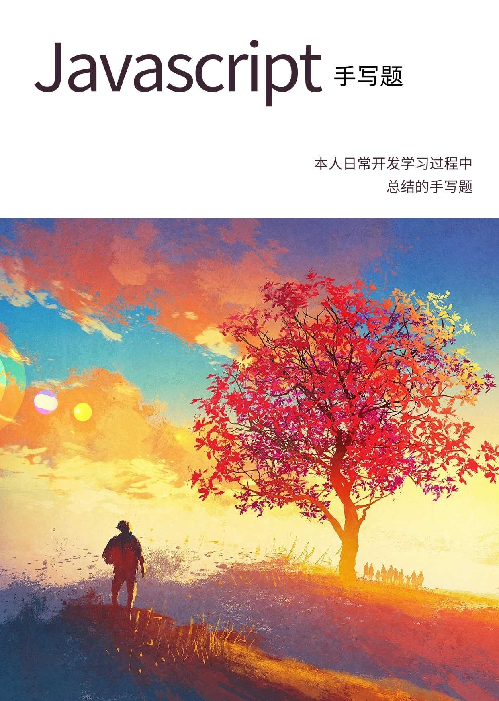

# 写在前面

下面这是本册的封面图  
寓意：向光阳光和自由  



# 手写题
## 1. 防抖
[jsFiddle ->](https://jsfiddle.net/olivio/w4xfcdv6/25/)
```js
function debounce(fn, delay, options) {
  let timer = null;
  let shouldInvoke = options.immediately // 是否立即执行
  return function(...args) {
    if (shouldInvoke) {
      fn.call(this, ...args)
      shouldInvoke = false
    }
    if (timer) {
      clearTimeout(timer)
    }
    timer = setTimeout(() => {
      fn.call(this, ...args)
      shouldInvoke = options.immediately
    }, delay)
  }
}
```
## 2. 节流
[jsFiddle](https://jsfiddle.net/olivio/c5jn691e/14/)
```js
// 节流函数
function throttle(fn, delay) {
  let timer = null
  return function (...args) {
    if (!timer) {
      fn.call(this, ...args)
      timer = setTimeout(() => {
        timer = null
      }, delay)
    } 
  }
}
```

## 3. 数组去重
```js
function uniqueArr(arr) {
  return [...new Set(arr)];
}
```
## 4. 数组扁平化
es6
```js
// 根据指定深度递归地将所有子数组元素拼接到新的数组中
// n默认1
function flat(arr, n) {
  return arr.flat(n)
}
```
```js
// 一层
function flat(arr) {
    return [].concat(...arr);
}
// 全部扁平化
function flat(arr) {
    while(arr.some(item => Array.isArray(item))) {
        arr = [].concat(...arr);
    }
    return arr;
}
```
```js
// 递归法
function flat(arr, deep) {
  if (deep === 0) {
    return arr
  }
  let ret = []
  for (let i = 0 ; i < arr.length ; i ++){
    if (Array.isArray(arr[i])) {
      ret.push(...flat(arr[i], deep - 1))
    } else {
      ret.push(arr[i])
    }
  }
  return ret
}
```
## 5. 深浅拷贝
## 6. 事件总线（发布订阅模式）
## 7. 图片懒加载
## 8. 函数柯里化
## 9. 偏函数
## 10. JSONP
## 11. AJAX
## 12. 实现数组原型方法
## 13. 实现函数原型方法
## 14. 实现 new 关键字
## 15. 实现 instanceof 关键字
## 16. 实现 Object.create
## 17. 实现 Object.assign
## 18. 实现 JSON.stringify
## 19. 实现 JSON.parse
## 20. 实现 Promise
## 21. 异步任务调度器

## 参考
- https://www.explainthis.io/zh-hans/swe/fe-whiteboard
- https://juejin.cn/post/6946022649768181774#heading-45
- https://juejin.cn/post/6968713283884974088?from=search-suggest#heading-19
